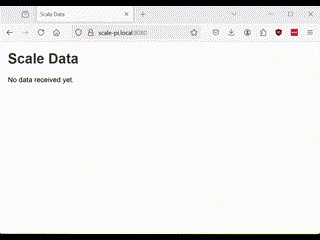
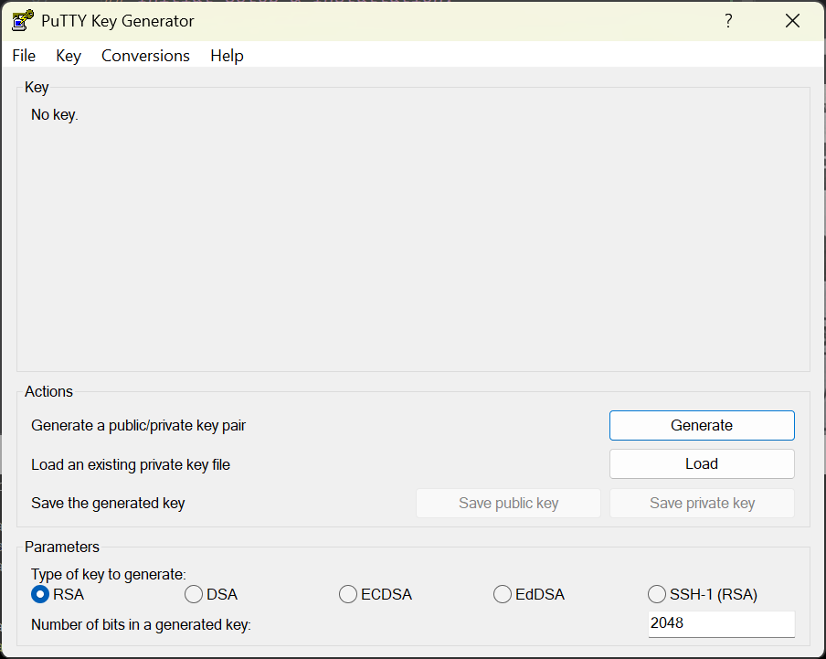
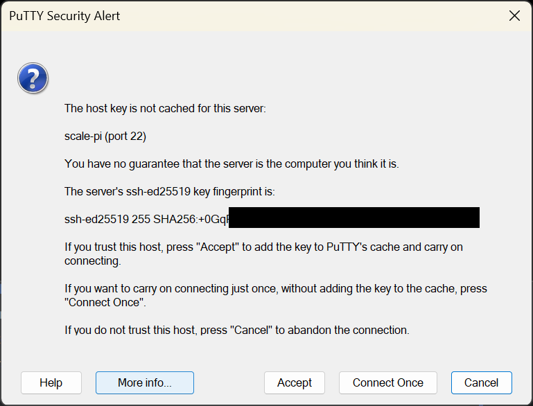

# ScaleReporter, a USB Scale Data Interface

This project interfaces with an electronic scale via USB and provides real-time weight updates through a web interface and an API.

This project was designed for use with "Health o meter" scales (I have a 1100L) and supports serial communication over a 
CP210x USB to UART Bridge. If this script is run in a Windows environment, a [driver](https://www.silabs.com/developer-tools/usb-to-uart-bridge-vcp-drivers) will be necessary. 
See the [Health O Meter Connectivity page](https://www.homscales.com/connectivitysolutions/) for the protocols for your scale if different from written.

## Compatibility:
Potentially could work with the following models, although I only have the 1100L to test. See the PDF in the reference 
folder to modify to the flavor of text your scale uses.

498KL, 500KL, 2210KL-AM, 597KL, 599KL, 752KL, 600KL, 2595KL, 522, 524, 553, 
1100, 1110, 2000, 2101, 2400, 2500, 2600, 2610, 2650, 2700, 2900, 3001, 3105

## HIPAA / Security:

This is a work in progress, and does not currently adequately protect health information. Information is transmitted in 
unencrypted free text. Anyone with access to the server address can reveal the last weight measurement. 

To help mitigate this risk short of a rewrite, this project (see below) is currently running on a Raspberry Pi Zero W with 
[Tailscale](https://tailscale.com/) installed, and the UFW firewall restricts access only from the TailScale network 
 to authorized client computer clients via ACLs. Extreme care must be used in order to avoid HIPAA violations.

You have been warned, this project and/or any contributors are not responsibility for any legal repercussions for 
deploying it, etc. etc.

---

## Features

- **Real-Time Weight Updates**: Displays weight data dynamically on a web interface.
- **WebSocket Support**: Provides real-time updates to connected clients.
- **REST API**: Serves the latest weight data as JSON.
- **Cross-Platform**: Works on Linux, macOS, and Windows (requires CP210x driver on Windows).
- **Easy-to-Use**: Includes a simple HTML interface for local testing.

---

## How It Works

1. **Data Parsing**:
   - The scale sends data packets over USB.
   - The program parses these packets to extract weight, height, BMI, and patient ID.

2. **Web Interface**:
   - A local web server on port `8080` displays weight data dynamically.
   - Real-time updates are sent to the webpage via WebSocket.

3. **API**:
   - A REST API endpoint (`/api`) serves the latest weight data in JSON format.

4. **WebSocket Endpoint**:
   - Clients can connect to `/ws` to receive live weight updates.

# General Usage

Start the Server:

```bash
python main.py
```

Access the Web Interface:
- Open your browser and navigate to http://localhost:8080/. The scale reports the data once you step off the scale.



Access the API:
- Send a GET request to http://localhost:8080/api to fetch the latest weight data in JSON format.

Connect via WebSocket:
- Connect to ws://localhost:8080/ws to receive live updates.

# File Structure
```
├── main.py            # Main application file
├── html/
│   └── static/
│       └── index.html # Frontend HTML with JavaScript for WebSocket integration
├── requirements.txt   # Python dependencies
├── README.md          # Project documentation
```

# Contributing

Contributions are welcome! Feel free to submit a pull request or file an issue.

# License

This project is licensed under the MIT License. You are free to use, modify, and distribute this software, provided that proper attribution is given.

# Acknowledgments

- FastAPI for the web framework. Love it. 
- Pydantic for data validation and parsing.
- Health o meter Scales (Sunbeam) for their hardware working well for 10+ years, and for publishing of their protocol publicly.

---

# Project Documentation

**Background**: I am a Family Physician and love tinkering, programming, teaching and learning. I like when my hobbies can
intersect with my profession as well. Maybe this will get used, who knows. It could potentially be adapted to report to 
an EMR I suppose, or maybe just used by a MA who keeps forgetting to write/remember the weight when they weigh a patient. 

**Audience**: My target audience for this writeup is writing at a level for someone who knows what a terminal is, but may not be overly 
familiar with linux. They know how to get here, but not sure if there is a .exe to download. There is not, this is python mainly.

**Purpose**: The following is documentation for use of a permanently installed Raspberry Pi in a headless configuration for the scale. 
This is intended to document the project as well as serve as a tutorial for anyone interested in trying it themselves. 
I will also likely need this guide if I need to troubleshoot or re-create it from scratch if/when it is stolen/lost/destroyed.

Consider trying the project from your laptop first to see if your scale is compatible and working.

Spoilers: It works great for me. I liked this project and a fun way to kill a few hours for a few free days.

## Parts List:
- [ ] Raspberry Pi Zero (32 bit only), which I am using, or [Raspberry Pi Zero 2 W](https://www.adafruit.com/product/5291) - $15.00. Really any computer or Pi will work. This is stupidly low load/requirement for any computer, and the Zero draws [only about 0.6-1.2W](http://raspi.tv/2017/how-much-power-does-pi-zero-w-use), which is ideal for this.
- [ ] Case for the Pi - I 3d printed one.
- [ ] USB-Micro cable for power - Use an old one, or consider [USB Power Only Cable with Switch](https://www.adafruit.com/product/2379) - $5.95
- [ ] MicroSD Card - at least 1GB
- [ ] USB-Micro to USB-B - Hard to find, but I bought one on [Amazon](https://www.amazon.com/Printer-Traovien-Android-Scanner-Electronic/dp/B099N1PWW6) for $10 for 2.
You can alternatively use a USB Mini to A adapter which I used temporarily, or just use a full size PI if you have one instead.
- [ ] Scale with connectivity, hopefully you have this already if you are seeing this.


## Initial Setup & Installation:

We will install the OS by writing to a micro-sd card directly, and set it up "headless", so we never have to use a monitor.

For this script, modify this section based on whichever operating system you are using.

### Generate an SSH Key pair.
You should set up SSH key before we image, so we can disallow any password logins and improve security for SSH.

I am doing this project from Windows, so I am using [PuTTY](https://www.chiark.greenend.org.uk/~sgtatham/putty/) 
as a SSH client. You can generate the SSH Key in PuTTY-Gen, which is also included in the download. 
Save the key safely/securely, use it in PuTTY to log in automatically. 



We will soon paste the public key into the Raspberry Pi Imager.

### Image Raspberry Pi OS (Raspbian):
Install Raspberry Pi OS using [Raspberry Pi Imager](https://www.raspberrypi.com/software/) on to your SD card. This is 
easier than using the older method of using [balenaEtcher](https://etcher.balena.io/) for the raspberry pi ISO.


Make sure that you input the Wi-Fi password, and paste the public key you generated in the last step.

This will take a few minutes, so in the meanwhile, let's set up the SSH client PuTTY:

### Save PuTTY configuration.
- Open up PuTTY 
- Type the address you chose "{name}.local" as the host name.
- On the left, open the tab: Connection->SSH->Auth->Credentials
- Select the key file you saved as *.ppk (PuTTY key format)
- On the left, open the tab: Connection->Data
- Type the username you had chosen
- On the left, open the first tab "Session" type a name for this config then click "Save" 

### Start the system
When the imager is finished, pop in the micro-sd card into the Pi and power the system up.

If everything is working as intended and the WiFi password is correct, you will see the device on your router's LAN list

### SSH into the running system
Go back to PuTTY and click your Saved Session configuration, click load, then "Open" on the bottom right.

Click "Accept" on the warning to trust the PI on first access of SSH


Hint: right-clicking the terminal will paste into the SSH console. Try this with the following section.

## Setting up the Raspberry Pi software

As with any new install, update everything
```bash
sudo apt update
```

```bash
sudo apt upgrade -y
```

Change some settings here, like expanding the filesystem:
```bash
sudo raspi-config
```

Restart the system, then reconnect with your SSH client after about 60 seconds.
```bash
sudo shutdown -r now
```

### Install GIT & Download Repository
Install git, otherwise you will need to just copy player.py directly and create a 'videos' folder
```bash
sudo apt install git -y
```

Install this repository in the folder of your choosing, or in "Home (~/)" aka the default directory if you don't plan on 
making another user run it. That would probably be better, but this is easier.
```bash
git clone https://github.com/STocidlowski/ScaleReporter
```

### Make a venv and install requirements
Make a "venv", a Virtual Environment, then install the requirements to this environment.
```bash
cd ScaleReporter
python3 -m venv ScaleReporter
source ScaleReporter/bin/activate
pip install -r requirements.txt
```
### Testing
Run it!
```bash
python3 ~/ScaleReporter/main.py
```

Try it out, see if it works. it will serve on :8080 by default.

Paste the name of your pi into your browser. for example: `scale-pi.local:8080` 

It should host a HTML page. If it does, we have success and we can plug in the scale and continue.

- Use `ctr-c` to stop the program

- When you're finished working in the virtual environment, run:
```bash
deactivate
```

Turn it off, signal shutdown
```bash
sudo shutdown -h now
```

Turn it off / unplug it after maybe 20 seconds. Relocate the pi to the scale and plug it in. 

---

Now that it is plugged into the scale, let's make sure we can see it the scale as an interface.

### USB serial permissions

List the USB devices connected. The scale only was here when I switched the USB ports. The Pi Zero does list one as for Power. Whoops.
```bash
sudo lsusb
```
You will hopefully find something similar to the following: `Bus 001 Device 002: ID 10c4:ea60 Silicon Labs CP210x UART Bridge`

Check the group ownership of the serial port. `ttyUSB0` will likely be it if there are no other plugged in USB devices.
```bash
ls -l /dev/ttyUSB0
```

It should show serial port belongs to the `dialout` group

Add the user to the `dialout` group
```bash
sudo usermod -aG dialout shawn
```

## Set up an automatic service to start the program

Setup the ScaleReporter service:
```bash
sudo nano /etc/systemd/system/ScaleReporter.service
```

Paste the following into the editor, fixing the directory name if it is different and save:
```systemd
[Unit]
Description=ScaleReporter
After=network.target

[Service]
WorkingDirectory=/home/shawn/ScaleReporter/
ExecStart=/home/shawn/ScaleReporter/ScaleReporter/bin/python /home/shawn/ScaleReporter/main.py
Restart=always
Environment=PYTHONUNBUFFERED=1
StandardOutput=journal
StandardError=journal
User=shawn
Group=dialout

[Install]
WantedBy=multi-user.target
```

```bash
sudo systemctl enable ScaleReporter.service
```

Reload the daemon if you make any changes
```bash
systemctl daemon-reload
```

Check the logs to see if everything went right:
```bash
journalctl -u ScaleReporter.service
```

Follow the logs in real-time with "-f"
```bash
journalctl -u ScaleReporter.service -f
```

## Final Test:

Restart and see if you can log in from your browser.
```bash
sudo shutdown -r now
```


## Optional Basic Security improvements
This project should include better security, but here is a very basic setup

### Tailscale
I installed [Tailscale](https://tailscale.com), because "it just works." and will encrypt data using the open 
source [WireGuard](https://www.wireguard.com/) as well as easy access control. Useful if you want to SSH from any connected authorized device, even if not on local LAN.
Use the Tailscale admin page to add a Linux server, and will automatically generate an installation script.
```bash
curl -fsSL https://tailscale.com/install.sh | sh && sudo tailscale up --auth-key=tskey-auth-.....
```
Automatically update, if desired. I do desire that.
```bash
sudo tailscale set --auto-update
```

You can now access the scale from anywhere, as long as the device is on the Tailnet. 

### NGINX
Forward traffic from :80 and :443 to our :8080 we are hosting using NGINX. This can be used to enable SSL in the future.

```bash
sudo apt install nginx -y
```

edit the sites:
Delete the symlink to the default, the original will remain in sites-available:
```bash
sudo rm /etc/nginx/sites-enabled/default
```

Add the new available site:
```bash
sudo nano /etc/nginx/sites-available/pi-scale
```

Paste the following:
```nginx
server {
    listen 80;
    server_name scale-pi;

    location / {
        proxy_pass http://localhost:8080;  # Forward to FastAPI app
        proxy_set_header Host $host;
        proxy_set_header X-Real-IP $remote_addr;
        proxy_set_header X-Forwarded-For $proxy_add_x_forwarded_for;
        proxy_set_header X-Forwarded-Proto $scheme;

        # WebSocket headers
        proxy_http_version 1.1;
        proxy_set_header Upgrade $http_upgrade;
        proxy_set_header Connection "upgrade";
    }
}

server {
    listen 443;
    server_name scale-pi;

    # Uncomment these lines and configure SSL certificates when ready
    # ssl_certificate /etc/letsencrypt/live/pi-scale/fullchain.pem;
    # ssl_certificate_key /etc/letsencrypt/live/pi-scale/privkey.pem;

    location / {
        proxy_pass http://localhost:8080;  # Forward to FastAPI app
        proxy_set_header Host $host;
        proxy_set_header X-Real-IP $remote_addr;
        proxy_set_header X-Forwarded-For $proxy_add_x_forwarded_for;
        proxy_set_header X-Forwarded-Proto $scheme;

        # WebSocket headers
        proxy_http_version 1.1;
        proxy_set_header Upgrade $http_upgrade;
        proxy_set_header Connection "upgrade";
    }
}

```

Create a symbolic link to enable the site:
```bash
sudo ln -s /etc/nginx/sites-available/pi-scale /etc/nginx/sites-enabled/
```

Test for syntax errors:
```bash
sudo nginx -t
```

Reload Nginx to apply changes:
```bash
sudo systemctl reload nginx
```

We should now be able to access this from tailscale without specifying a port: http://scale-pi/

### UFW - Firewall
Now, lets only allow the tailnet to access this machine. I will also allow local SSH, just in case tailscale fails for some reason.

Install UFW
```bash
sudo apt install ufw -y
```

Only allow port 22 inbound on lan (192.168.1.) or on the Tailscale network (100.)

Only allow http(s) inbound from the Tailscale network (100.):
```bash
sudo ufw default deny incoming
sudo ufw default allow outgoing
sudo ufw allow from 192.168.1.0/24 to any port 22
sudo ufw allow in on tailscale0 to any port 22
sudo ufw allow in on tailscale0 to any port 80
sudo ufw allow in on tailscale0 to any port 443
```

Allowing connections to UDP port 41641 may help Tailscale make a peer-to-peer connection without a relay
```bash
sudo ufw allow 41641/udp
```

Review the UFW rules to ensure they are set correctly:
```bash
sudo ufw status numbered
```

```text
     To                         Action      From
     --                         ------      ----
[ 1] 22                         ALLOW IN    192.168.1.0/24
[ 2] 41641/udp                  ALLOW IN    Anywhere
[ 3] 22 on tailscale0           ALLOW IN    Anywhere
[ 4] 80 on tailscale0           ALLOW IN    Anywhere
[ 5] 443 on tailscale0          ALLOW IN    Anywhere
[ 6] 41641/udp (v6)             ALLOW IN    Anywhere (v6)
[ 7] 22 (v6) on tailscale0      ALLOW IN    Anywhere (v6)
[ 8] 80 (v6) on tailscale0      ALLOW IN    Anywhere (v6)
[ 9] 443 (v6) on tailscale0     ALLOW IN    Anywhere (v6)
```


Enable UFW and restart ssh:
```bash
sudo ufw enable
sudo service ssh restart
```

Or restart ufw and ssh
```bash
sudo ufw reload
sudo service ssh restart
```

### Ultimate test:
- Try logging in and/or  using the site - should work
- Quit the Tailscale client on your local machine, then try using the site or logging in again - should fail.


That's it, we are only allowing us to access our server from an authorized device, and have "zero trust" implementation

Hope your project went as well as mine.

- ST

---
